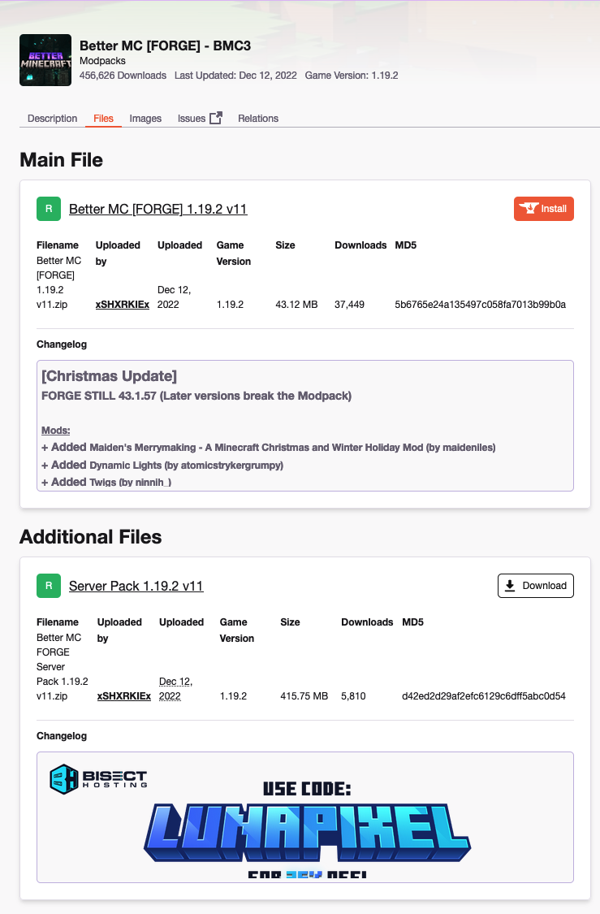
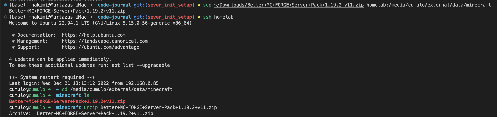
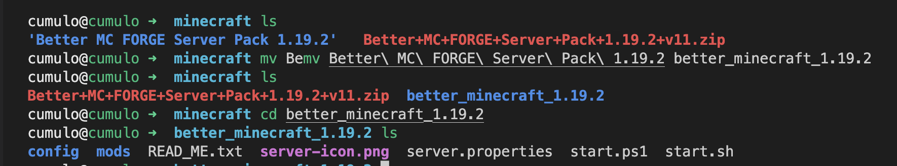
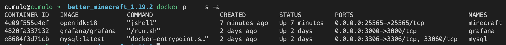
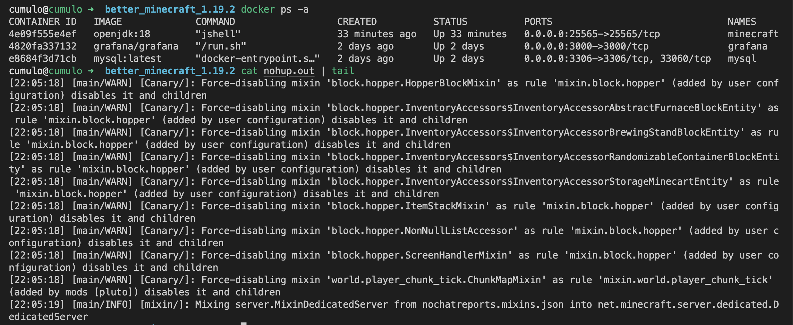
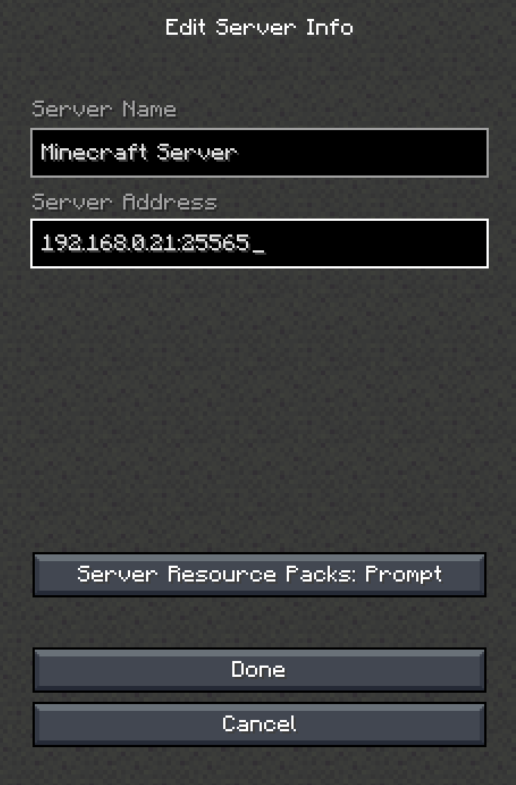
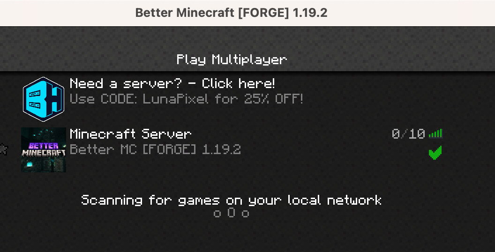

# :video_game: Minecraft Server Setup

The setup differs between different modpacks so you might have to make adjustments, but this will cover the general steps to get it running, and most importantly how to run it from docker containers. (If you want to use docker you will need to follow the server setup instructions [here](../server_setup/init_server_setup.md))

Opensource setup: https://github.com/itzg/docker-minecraft-server

**Table of Contents:**
- [:video\_game: Minecraft Server Setup](#video_game-minecraft-server-setup)
  - [:stars: Download](#stars-download)
  - [:rocket: Upload to Server](#rocket-upload-to-server)
  - [:dolphin: Setup Docker Container](#dolphin-setup-docker-container)
  - [:computer: Connect from Minecraft](#computer-connect-from-minecraft)
  - [:no\_entry: Cleanup](#no_entry-cleanup)

## :stars: Download

This is example will use the Better Minecraft modpack, you can download other modpacks from [here](https://www.curseforge.com/minecraft/modpacks)



## :rocket: Upload to Server

Sometimes the forge server installation requires a pull from the forge servers for the java `.jar` files and prompts with a UI. For this I like setting up the server files locally and then uploading them to the server.

With Better Minecraft we can just set it up on the server. Upload the files to the server using `scp`. Then decompress those files.

```bash
scp ~/path/to.zip homelab:/path/on/server
ssh homelab
cd /path/on/server
unzip filename.zip
```



Use `ls` to confirm the folder was created properly. Use the `mv` command to rename the folder and avoid spaces.

```bash
ls
mv /folder_to_rename /new_folder_name
```



## :dolphin: Setup Docker Container

We will start a docker container named `minecraft` and mount the minecraft directory as a volume.

**\*\*NOTE:\*\*** Make sure to check which java version is needed for your modpack.

```bash
docker run -it -d --name minecraft -v /path/to/files:/minecraft -p 25565:25565 openjdk:<java version>
```

Afterwards you should see a docker container running with `docker ps -a`:



To enter into the container and start the server we'll use the `docker exec` command.

```bash
docker exec -it minecraft bash
```

From here you can run any commands that you normall would from your terminal:

```bash
cd /minecraft/path/to/modpack
```

Use the `README.md` provided in the server files to tailor steps for specific modpacks. If following along with Better Minecraft you can do `sh start.sh`.

Once you have confirmed its working you can start the server as a background proccess and exit the docker container:

```bash
nohup sh start.sh & > nohup.out
exit
```

You can take a look at the logs by checking the `nohup.out` file.

```bash
cat nohup.out | tail
```



## :computer: Connect from Minecraft

Now you should be able to connect with `<ip_address>:25565` to your server as long as you're on the same network. To expose it outside of your network check the dns configuration instructions [here](../server_setup/init_server_setup.md)





## :no_entry: Cleanup

To stop the minecraft server simply stop the docker container.

```bash
docker stop minecraft
```