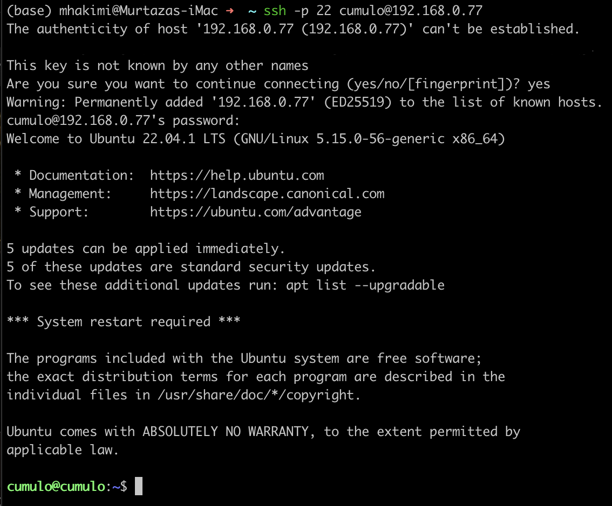

# :books: Initial Server Setup Documentation

**Table of Contents:**
- [:books: Initial Server Setup Documentation](#books-initial-server-setup-documentation)
  - [:computer: Ubuntu Desktop](#computer-ubuntu-desktop)
    - [:memo: Install Usefull Packages](#memo-install-usefull-packages)
    - [:art: Customization](#art-customization)
  - [:signal\_strength: OpenSSH Server](#signal_strength-openssh-server)
    - [:arrow\_down: Install Server](#arrow_down-install-server)
    - [:wrench: Configure Port](#wrench-configure-port)
    - [:key: Setup SSH Keygen Connection](#key-setup-ssh-keygen-connection)
  - [:seedling: Git Installation](#seedling-git-installation)
  - [:rainbow: ZSH Terminal Setup](#rainbow-zsh-terminal-setup)
    - [:black\_nib: Zsh Setup](#black_nib-zsh-setup)
    - [:open\_mouth: Oh My Zsh Setup](#open_mouth-oh-my-zsh-setup)
    - [:flashlight: Syntax Highlighting](#flashlight-syntax-highlighting)
    - [:slot\_machine: Auto Suggestions](#slot_machine-auto-suggestions)
  - [:dolphin: Docker Setup](#dolphin-docker-setup)
    - [:bar\_chart: Grafana Container](#bar_chart-grafana-container)
    - [:package: MySQL Container](#package-mysql-container)
  - [:twisted\_rightwards\_arrows: DNS Configuration](#twisted_rightwards_arrows-dns-configuration)
  - [:arrows\_counterclockwise: Reverse Proxy](#arrows_counterclockwise-reverse-proxy)

## :computer: Ubuntu Desktop

First step is to install ubuntu desktop on an old laptop. Instructions for that can be found [here](https://ubuntu.com/tutorials/install-ubuntu-desktop#1-overview)

### :memo: Install Usefull Packages

`vim` will serve as the terminal based text editor. `vim` docs can be found [here](https://www.tutorialspoint.com/vim/vim_installation_and_configuration.htm)

Use `:syntax on` to get syntax highlighting

```bash
sudo apt-get update 
sudo apt-get install vim
```

`curl` will be used to install other packages later. `curl` docs can be found [here](https://curl.se/)

```bash
sudo apt-get install curl
```

`cron` is a time-based job scheduler for unix systems. The docs can be found [here](https://help.ubuntu.com/community/CronHowto). To add a job to the schedule simply edit `/etc/crontab`

```bash
sudo apt-get install cron
systemctl status cron
```

### :art: Customization

Keep laptop from sleeping when the lid is closed.

```bash
vim /etc/systemd/logind.conf
```

The `HandleLidSwitch=suspend` line has these options available:

```vim
HandleLidSwitch=lock # – lock when lid closed.
HandleLidSwitch=ignore # – do nothing.
HandleLidSwitch=poweroff # – shutdown.
HandleLidSwitch=hibernate # – hibernate Ubuntu.
```

Restart the login dameaon to activate the changes:

```bash
systemctl restart systemd-logind.service
```

## :signal_strength: OpenSSH Server

OpenSSH server will allow us to remotely access the server from the terminal. Instructions for that can be found [here](https://ubuntu.com/server/docs/service-openssh)

### :arrow_down: Install Server

```bash
sudo apt-get install openssh-server
```

You can get your ip address with `ip a` and use that to connect to the server at `ssh  -p 22 <username>@<ip>`



### :wrench: Configure Port

**\*\*NOTE:** *Copy and lock the original config file to prevent accidental changes*
```bash
sudo cp /etc/ssh/sshd_config /etc/ssh/sshd_config.original
sudo chmod a-w /etc/ssh/sshd_config.original
```

We will change the default port number to make things more secure:

```bash
sudo vim /etc/ssh/sshd_config
```


Restart the ssh server

```bash
sudo systemctl restart sshd.service
```

### :key: Setup SSH Keygen Connection

```bash
ssh-keygen
vim ~/.ssh/config
```


Add your new server to your ssh config to make it easier to log in.

```bash
ssh-copy-id <hostname>
```


Now you  should be able to `ssh <hostname>` without having to type in your password or remember the ip and port numbers.

## :seedling: Git Installation

Git will be needed to pull in our code. Installation instructions can be found [here](https://git-scm.com/book/en/v2/Getting-Started-Installing-Git)

**\*\*TODO:\*\***

Git configuration example:

```bash

```

## :rainbow: ZSH Terminal Setup

### :black_nib: Zsh Setup

**Zsh Installation** docs can be found [here](https://github.com/ohmyzsh/ohmyzsh/wiki/Installing-ZSH)

```bash
sudo apt-get install zsh
```

### :open_mouth: Oh My Zsh Setup

**Oh My Zsh** docs can be found [here](https://github.com/ohmyzsh/ohmyzsh/wiki)

```bash
sh -c "$(curl -fsSL https://raw.githubusercontent.com/ohmyzsh/ohmyzsh/master/tools/install.sh)"
```

### :flashlight: Syntax Highlighting

**Zsh Syntax Highlighting** docs can be found [here](https://github.com/zsh-users/zsh-syntax-highlighting/blob/master/INSTALL.md)

```bash
git clone https://github.com/zsh-users/zsh-syntax-highlighting.git
echo "source ${(q-)PWD}/zsh-syntax-highlighting/zsh-syntax-highlighting.zsh" >> ${ZDOTDIR:-$HOME}/.zshrc
source ./zsh-syntax-highlighting/zsh-syntax-highlighting.zsh
```

### :slot_machine: Auto Suggestions

**Zsh Auto Suggestions** docs can be found [here](https://github.com/zsh-users/zsh-autosuggestions/blob/master/INSTALL.md)

```bash
git clone https://github.com/zsh-users/zsh-autosuggestions ${ZSH_CUSTOM:-~/.oh-my-zsh/custom}/plugins/zsh-autosuggestions
```

Add it to the list of plugins with `vim ~/.zshrc`

```vim
plugins=( 
    # other plugins...
    zsh-autosuggestions
)
```

## :dolphin: Docker Setup

Since we are on ubuntu desktop we can just install docker desktop from the browser. The docker docs and installation instructions can be found [here](https://docs.docker.com/desktop/install/ubuntu/)

### :bar_chart: Grafana Container

**\*\*TODO\*\***

### :package: MySQL Container

**\*\*TODO\*\***

## :twisted_rightwards_arrows: DNS Configuration

**\*\*TODO:\*\*** Configure router dns so that we can use hostnames instead of ip addresses on our local network.

## :arrows_counterclockwise: Reverse Proxy

**\*\*TODO:\*\*** Configure the proxy so we don't have to remember the ports for each service.