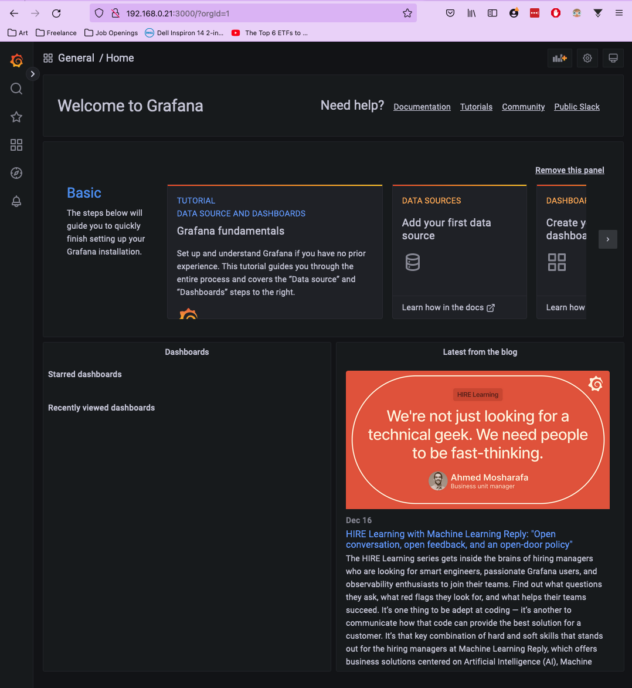

# :books: Initial Server Setup Documentation

**Table of Contents:**
- [:books: Initial Server Setup Documentation](#books-initial-server-setup-documentation)
  - [:computer: Ubuntu Desktop](#computer-ubuntu-desktop)
    - [:memo: Install Usefull Packages](#memo-install-usefull-packages)
    - [:art: Customization](#art-customization)
  - [:signal\_strength: OpenSSH Server](#signal_strength-openssh-server)
    - [:arrow\_down: Install Server](#arrow_down-install-server)
    - [:wrench: Configure Port](#wrench-configure-port)
    - [:key: Setup SSH Keygen Connection](#key-setup-ssh-keygen-connection)
  - [:seedling: Git Installation](#seedling-git-installation)
  - [:rainbow: ZSH Terminal Setup](#rainbow-zsh-terminal-setup)
    - [:black\_nib: Zsh Setup](#black_nib-zsh-setup)
    - [:open\_mouth: Oh My Zsh Setup](#open_mouth-oh-my-zsh-setup)
    - [:flashlight: Syntax Highlighting](#flashlight-syntax-highlighting)
    - [:slot\_machine: Auto Suggestions](#slot_machine-auto-suggestions)
  - [:dolphin: Docker Setup](#dolphin-docker-setup)
    - [:factory: Installation](#factory-installation)
    - [:bar\_chart: Grafana Container](#bar_chart-grafana-container)
    - [:package: MySQL Container](#package-mysql-container)
  - [:twisted\_rightwards\_arrows: DNS Configuration](#twisted_rightwards_arrows-dns-configuration)
  - [:arrows\_counterclockwise: Reverse Proxy](#arrows_counterclockwise-reverse-proxy)

## :computer: Ubuntu Desktop

First step is to install ubuntu desktop on an old laptop. Instructions for that can be found [here](https://ubuntu.com/tutorials/install-ubuntu-desktop#1-overview)

### :memo: Install Usefull Packages

`vim` will serve as the terminal based text editor. `vim` docs can be found [here](https://www.tutorialspoint.com/vim/vim_installation_and_configuration.htm)

Use `:syntax on` to get syntax highlighting

```bash
sudo apt-get update 
sudo apt-get install vim
```

`curl` will be used to install other packages later. `curl` docs can be found [here](https://curl.se/)

```bash
sudo apt-get install curl
```

`cron` is a time-based job scheduler for unix systems. The docs can be found [here](https://help.ubuntu.com/community/CronHowto). To add a job to the schedule simply edit `/etc/crontab`

```bash
sudo apt-get install cron
systemctl status cron
```

### :art: Customization

Keep laptop from sleeping when the lid is closed.

```bash
sudo vim /etc/systemd/logind.conf
```

The `HandleLidSwitch=suspend` line has these options available:

```vim
HandleLidSwitch=lock # – lock when lid closed.
HandleLidSwitch=ignore # – do nothing.
HandleLidSwitch=poweroff # – shutdown.
HandleLidSwitch=hibernate # – hibernate Ubuntu.
```

Restart the login dameaon to activate the changes:

```bash
systemctl restart systemd-logind.service
```

## :signal_strength: OpenSSH Server

OpenSSH server will allow us to remotely access the server from the terminal. Instructions for that can be found [here](https://ubuntu.com/server/docs/service-openssh)

### :arrow_down: Install Server

```bash
sudo apt-get install openssh-server
```

You can get your ip address with `ip a` and use that to connect to the server at `ssh  -p 22 <username>@<ip>`


### :wrench: Configure Port

**\*\*NOTE:** *Copy and lock the original config file to prevent accidental changes*
```bash
sudo cp /etc/ssh/sshd_config /etc/ssh/sshd_config.original
sudo chmod a-w /etc/ssh/sshd_config.original
```

We will change the default port number to make things more secure:

```bash
sudo vim /etc/ssh/sshd_config
```


Restart the ssh server

```bash
sudo systemctl restart sshd.service
```

### :key: Setup SSH Keygen Connection

```bash
ssh-keygen
vim ~/.ssh/config
```


Add your new server to your ssh config to make it easier to log in.

```bash
ssh-copy-id <hostname>
```


Now you  should be able to `ssh <hostname>` without having to type in your password or remember the ip and port numbers.

## :seedling: Git Installation

Git will be needed to pull in our code. Installation instructions can be found [here](https://git-scm.com/book/en/v2/Getting-Started-Installing-Git)

```bash
sudo apt install git-all
```

Generate a new SSH key and adding it to the ssh-agent. Instructions for that can be found [here](https://docs.github.com/en/authentication/connecting-to-github-with-ssh/generating-a-new-ssh-key-and-adding-it-to-the-ssh-agent)

```bash
ssh-keygen -t ed25519 -C "your_email@example.com"
eval "$(ssh-agent -s)"
ssh-add ~/.ssh/id_ed25519
```

Copy the ssh public key using `cat ~/.ssh/id_ed25519.pub` and add it to your github account from the browser. Instructions for that can be found [here](https://docs.github.com/en/authentication/connecting-to-github-with-ssh/adding-a-new-ssh-key-to-your-github-account?platform=linux&tool=webui)

## :rainbow: ZSH Terminal Setup

### :black_nib: Zsh Setup

**Zsh Installation** docs can be found [here](https://github.com/ohmyzsh/ohmyzsh/wiki/Installing-ZSH)

```bash
sudo apt-get install zsh
```

### :open_mouth: Oh My Zsh Setup

**Oh My Zsh** docs can be found [here](https://github.com/ohmyzsh/ohmyzsh/wiki)

```bash
sh -c "$(curl -fsSL https://raw.githubusercontent.com/ohmyzsh/ohmyzsh/master/tools/install.sh)"
```

Customize your zsh prompt by setting the `PROMPT` env variable to the end of your `~/.zshrc`

```bash
vim ~/.zshrc
```

```vim
PROMPT="$fg[white]%}$USER@%{$fg[green]%}%m ${PROMPT}"
```


### :flashlight: Syntax Highlighting

**Zsh Syntax Highlighting** docs can be found [here](https://github.com/zsh-users/zsh-syntax-highlighting/blob/master/INSTALL.md)

```bash
git clone https://github.com/zsh-users/zsh-syntax-highlighting.git
echo "source ${(q-)PWD}/zsh-syntax-highlighting/zsh-syntax-highlighting.zsh" >> ${ZDOTDIR:-$HOME}/.zshrc
source ./zsh-syntax-highlighting/zsh-syntax-highlighting.zsh
```

### :slot_machine: Auto Suggestions

**Zsh Auto Suggestions** docs can be found [here](https://github.com/zsh-users/zsh-autosuggestions/blob/master/INSTALL.md)

```bash
git clone https://github.com/zsh-users/zsh-autosuggestions ${ZSH_CUSTOM:-~/.oh-my-zsh/custom}/plugins/zsh-autosuggestions
```

Add it to the list of plugins with `vim ~/.zshrc`

```vim
plugins=( 
    # other plugins...
    zsh-autosuggestions
)
```

## :dolphin: Docker Setup

Since we are on ubuntu desktop we can just install docker desktop from the browser. The docker docs and installation instructions can be found [here](https://docs.docker.com/desktop/install/ubuntu/)

### :factory: Installation

Update the `apt` package index and install packages to allow `apt` to use a repository over HTTPS:

```bash
sudo apt-get update
sudo apt-get install \
    ca-certificates \
    curl \
    gnupg \
    lsb-release
```

Add Docker’s official GPG key:

```bash
sudo mkdir -p /etc/apt/keyrings
curl -fsSL https://download.docker.com/linux/ubuntu/gpg | sudo gpg --dearmor -o /etc/apt/keyrings/docker.gpg
```

Use the following command to set up the repository:

```bash
echo \
  "deb [arch=$(dpkg --print-architecture) signed-by=/etc/apt/keyrings/docker.gpg] https://download.docker.com/linux/ubuntu \
  $(lsb_release -cs) stable" | sudo tee /etc/apt/sources.list.d/docker.list > /dev/null
```

Install the docker debian binary:

```bash
sudo apt-get update
sudo apt-get install ./docker-desktop-<version>-<arch>.deb
```

Log into docker, but first need to initialize `pass` to authenticate. Instructions for that can be found [here](https://docs.docker.com/desktop/get-started/)

```bash
gpg --generate-key
pass init <generated_public_key>
```

The `gpg --generate-key` step will open a prompt for you to create a password in the ubuntu desktop os ui. After this step is complete you will be able to click the sign-in button in the docker desktop application.

### :bar_chart: Grafana Container

The docker grafana docs can be found [here](https://hub.docker.com/r/grafana/grafana)

```bash
docker pull grafana/grafana
docker run -d --name=grafana -p 3000:3000 -v /path/to/data:/var/lib/grafana --network=host --restart unless-stopped grafana/grafana
```

You should now be able to access the grafana dashboard from `<ip_address>:3000`. The default credentials are `admin/admin`.



Create a grafana read only user in mysql. `CREATE` user and `PRIVILEGES` docs can be found [here](https://dev.mysql.com/doc/refman/8.0/en/creating-accounts.html)

```mysql
CREATE USER 'grafana'@'%'
  IDENTIFIED BY 'read-only';
GRANT SELECT
  ON *.*
  TO 'grafana'@'%'
  WITH GRANT OPTION;

FLUSH PRIVILEGES;
```

`FLUSH PRIVILEGES` is needed to make the user permissions take effect.

Finally, a datasource needs to be added to grafana. You can do that by clicking the settings icon in the bottom left, `settings -> data sources`.


Each docker container creates its in own network. We need to find the ip address of the `mysql` container so the `grafana` container can connect to it:

```bash
docker inspect mysql | grep "IPAddress"
```


### :package: MySQL Container

MySQL docker container docs can be found [here](https://hub.docker.com/_/mysql)

We'll use a volume mount to persit the data even if our mysql server or docker container goes down. The docs for that can be found [here](https://docs.docker.com/get-started/06_bind_mounts/)

```bash
docker pull mysql:latest
docker run --name mysql -p 3306:3306 -v /path/to/data:/var/lib/mysql -e MYSQL_ROOT_PASSWORD=my-secret-pw -d --restart unless-stopped mysql:latest
```

Now we should be able to access our database at `<username>@<ip_address>:<port>`. Example with mysql workbench shown below:


Select the `MySQL` data source and follow the instructions to setup the connections.

## :twisted_rightwards_arrows: DNS Configuration

**\*\*TODO:\*\*** Configure router dns so that we can use hostnames instead of ip addresses on our local network.

## :arrows_counterclockwise: Reverse Proxy

**\*\*TODO:\*\*** Configure the proxy so we don't have to remember the ports for each service.